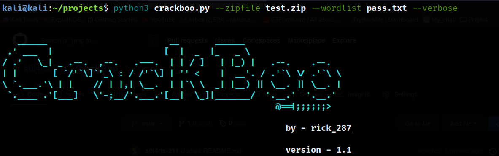

# CrackBoo
Note: This a public project which is now in underdevelopment. I made this with python version 3. If you want to contribute on this project, you can reach me through my social media accounts. I will appreciate you help on this project.

## Bannar

## Tools-Description

Crackboo is a tool made in python language. This tool will help you to crack protected zip file password with a great vizualization. The tool only able to crack zip and rar file at this moment, but future version will get more features add in this tool.

### Installation

git clone https://github.com/s0l4ris-211/CrackBoobr>
cd /CrackBoobr>
chmod +x crackboo.pybr>
python3 crackboo.py [arguments]
